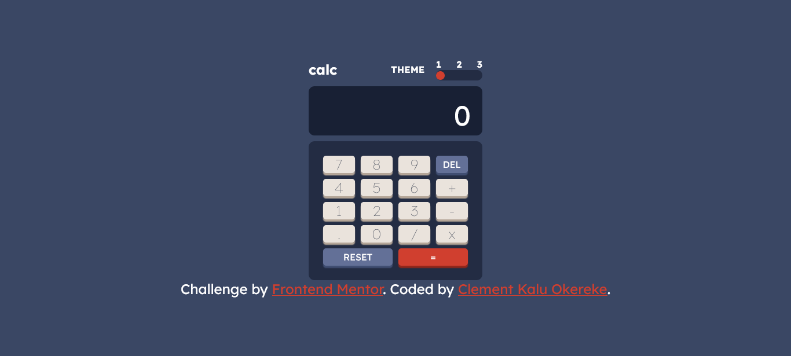

# Frontend Mentor - Calculator app solution

This is a solution to the [Calculator app challenge on Frontend Mentor](https://www.frontendmentor.io/challenges/calculator-app-9lteq5N29). Frontend Mentor challenges help you improve your coding skills by building realistic projects.

## Table of contents

- [Overview](#overview)
  - [The challenge](#the-challenge)
  - [Screenshot](#screenshot)
  - [Links](#links)
- [Frontend Mentor - Calculator app solution](#frontend-mentor---calculator-app-solution)
  - [Table of contents](#table-of-contents)
  - [Overview](#overview)
    - [The challenge](#the-challenge)
    - [Screenshot](#screenshot)
    - [Links](#links)
  - [My process](#my-process)
    - [Built with](#built-with)
    - [What I learned](#what-i-learned)
    - [Continued development](#continued-development)
    - [Useful resources](#useful-resources)
  - [Author](#author)
  - [Acknowledgments](#acknowledgments)

## Overview

### The challenge

Your challenge is to build out this calculator app and get it looking as close to the design as possible.
Users should be able to:

- See the size of the elements adjust based on their device's screen size

- Perform mathematical operations like addition, subtraction, multiplication, and division

- Adjust the color theme based on their preference

- **Bonus**: Have their initial theme preference checked using `prefers-color-scheme` and have any additional changes saved in the browser

### Screenshot

### Links

- Solution URL: [Add solution URL here](https://your-solution-url.com)

- Live Site URL: [Add live site URL here](https://your-live-site-url.com)

## My process

### Built with

- Semantic HTML5 markup
- CSS custom properties
- Flexbox
- CSS Grid
- Mobile-first workflow

### What I learned

While building the project, I learned how to store data and variables in HTML elements using the `[data-*]` attribute.

I also learned how to use the `querySelectorAll()` method to get specific elements or elements with specific classes or id

I also practiced looping through arrays using the `forEach()` loop

### Continued development

I wish to practice storing data in HTML elements

### Useful resources

- [Example resource 1](https://www.example.com) - This helped me understand how to use the `eval()` function to perform mathematical operations

## Author

- Website - [Clement Kalu Okereke](https://clement-portfolio.w3spaces.com)
- Frontend Mentor - [@Clement1kalu-okereke](https://www.frontendmentor.io/profile/Clement1kalu-okereke)
- Twitter - [@ClementKaluoke2](https://www.twitter.com/ClementKaluoke2)

## Acknowledgments

Special Thanks to all @frontendmentor especially @PranshuSahu thanks to your contribution to the community  , I was able to get an idea of the JavaScript `eval()` function
